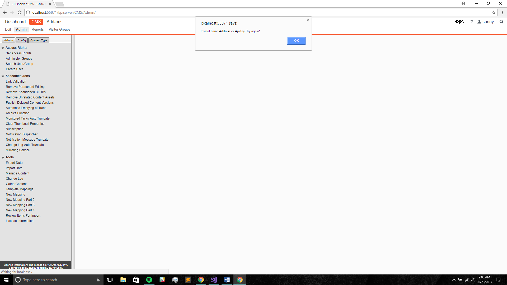

**GatherContent - EPiServer Integration**

**Introduction:**

How to get started with the GatherContent&#39;s EPiServer Integration to import your content.

Integrate GatherContent with EPiServer 10.2 (or higher) and ASP.NET Web Forms 4.5.2. You can:

- Migrate content into EPiServer

**How it works**

With our EPiServer add-on, you can easily import all your content from GatherContent into your EPiServer website. EPiServer&#39;s wide customization allows you to import the content as pages and blocks with user defined page and block types.

To import content, template mappings must be created. This allows you to map each field in your GatherContent Templates with EPiServer fields and import the items as pages or blocks. At this stage, the add-on only supports importing from GatherContent into EPiServer.

**Versions Supported**

The module supports EPiServer 10.2+ and ASP.NET Web Forms 4.5.2.

**Installation:**

**Configuration:**

Setting up the GatherContent EPiServer integration.

Once the installation of the add-on is complete, you can access it in the admin control panel.

This is the path to navigate to the add-on: /EPiServer/CMS/Admin

The add-on is in the tools section of the Admin side menu. And it can be configured by selecting GatherContent Setup from the menu.

You will need the email address and the API key associated with your GatherContent account to use the add-on.

Enter your GatherContent account email address, the API key you generated from GatherContent, and the Platform URL (account slug). For more information on how to get your API key, [check out our guide here](https://docs.gathercontent.com/v0.5/reference#authentication).

Click &#39;Save Changes&#39; to authenticate your credentials and save them. Once authenticated, you will see a pop-up message that says, &quot;Hello User! You have successfully connected to the GatherContent API&quot;

If the authentication was unsuccessful, you will also get a pop-up message, stating that your credentials are invalid.

After the user authentication, you can see all your GatherContent accounts in the account selection drop-down. The first account in the list is selected by default. If you wish to switch to a different account, choose from the drop-down and click &#39;Save Changes&#39; again.

Note: These values will remain the same until otherwise changed by the user.

**Mapping Setup:**

Setup mappings between templates in GatherContent and templates in EPiServer.

To import content from GatherContent into EPiServer, you need to first create a template mapping. Once mapped, items from GatherContent can be imported as desired content types. Follow these steps to create a template mapping.

On the side menu, you will see another option in the tools section called &#39;New GC Mapping Step 1&#39;. Click on that to start creating a new mapping. That will take you to the first step of the mapping i.e., &#39;Project Selection&#39;.

Now, all the projects you have defined for your GatherContent account will appear here. Choose the project you would like to create the mapping for and click &#39;Next Step&#39;.

If you needed to change any of your configuration settings, you can do that by clicking on the &#39;Back to API step&#39; button.

Once &#39;Next Step&#39; button is clicked, you will be directed to the step 2 page where in you can select the GatherContent template.

In this step, you will see all the templates defined for that project. You can also see the description for each template. Now, choose a template you would like to create the mapping for. If a template is already mapped, you will not be allowed to create a duplication. Instead, you can click on &#39;Review Items for Import&#39; link to directly access the items for import.

Finally, click &#39;Next Step&#39; to proceed to set the mapping defaults.

Select the EPiServer content type (Page type / Block type) for your items to be imported as. Based on the selected type, EPiServer templates will be populated in the adjacent drop down. Select the author and default status too.

If you want to map each individual GatherContent status to an EPiServer status, you can do that too. By default, all the items are set to use the default status set in previous step.

Once the mapping defaults are set, click &#39;Next Step&#39;. This will take you to map the GatherContent fields to EPiServer content fields.

Here you can map each individual GatherContent field to an EPiServer field. By default, all the content fields are set to &#39;Do not import&#39;. You may import just some fields or all the fields or none at all, it is totally upto you.

Note: This is a one-to-one mapping. So, using the same EPiServer field for multiple GatherContent fields will override the previously mapped field.

Once the  fields are mapped, click &#39;Save mapping&#39;. This will save your mapping and your items will be ready for import.

When you are ready to import your content or if you wish to edit your mappings, you can do that by going to the &#39;Template Mappings&#39; page. Just select &#39;GC-EPi Template mappings&#39; from the side menu.

Here you can see all your saved mappings.

For each template mapping, there is an &#39;Edit Mapping&#39;  button. This will let you alter the template mapping.

You can delete template mappings if you wish to. Select the template mappings you want to delete and hit &#39;Delete&#39; button.

**Review Items:**

You can import GatherContent item(s) by clicking the &#39;Review Items&#39;. You will be able  to see the name of GatherContent item, item&#39;s GatherContent status, the last updated date for that item, a dropdown for selecting the parent Page/Content Folder and the EPiServer import status.

You can import just one or some or all the items at once. Just select the items you want to import and hit &#39;import items&#39;.

Once imported, If the imported item was a block, the import status will change to &#39;block imported&#39;.

If the imported item was a page, the import status of the item(s) will change to &#39;page imported&#39;. Additionally, the status will have the link to the page you just created.

**Custom imports:**

EPiServer&#39;s customization allows you to import the items to any specific destination URL by selecting the parent page or content folder.

**For eg:**  Let&#39;s say there was a page in your EPiServer website called &#39;News Articles&#39; and its URL was: www.loremipsum.com/articles/news-articles.

 If you want to add a new page under &#39;news-articles&#39;, all you have to do is select &#39;news-articles&#39; page from the dropdown, check the checkbox of that item and hit &#39;import items&#39; button. Now, the page is imported under &#39;news-articles&#39;.

If your website has a very large number of items, it will be tedious to choose a parent page/block for all the items individually. So, to make things easier, we have added a feature where in you can set a default parent page/block for all the items of this mapping.

All you have to do is, select the default parent from &#39;Default Parent Page/Block&#39; drop-down and hit button &#39;Set&#39;. Now, the parent selection drop-down for all the items will show results from the selected default page instead of root page.

However, if you are not concerned about a specific destination for your item, just ignore the dropdown.

Note: By default, the parent page is set to root page.

**What happens when a page/block is moved to trash:**

When a page/block is moved to the trash, the status of that item will be shown as &#39;Page in trash&#39;. This is to just prevent user from creating duplicate pages or blocks.

This item will only be available for re-import if that item is deleted even from the trash.

However, if the item is restored from trash, the import status of the item will be reverted back to &#39;Page/Block imported&#39;.

Note: When moving an item to the trash, please make sure that the child item is first moved (if there are any).